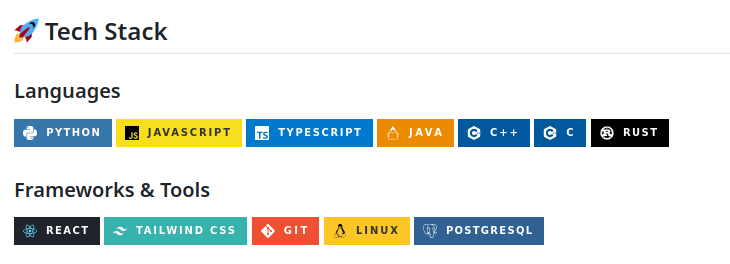
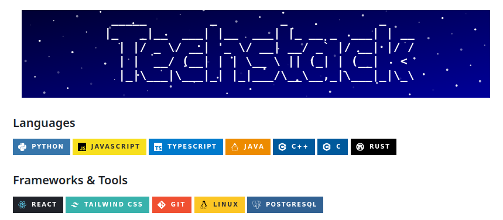

# ASCII Galaxy README Generator

[](LICENSE)

## Table of Contents

- [Introduction](#introduction)
- [Installation](#installation)
- [Usage](#usage)
- [Contributing](#contributing)
- [License](#license)

## Introduction

ASCII Galaxy is a dynamic README title generator that transforms your GitHub profile by adding a cool, animated ASCII art title. Instead of static text, you can now have an eye-catching, animated ASCII art header that brings more personality to your project's README.

### Before

### After


## Usage

### Basic Usage
You can visit  for demo
Add the following markdown to your README:

```markdown
[](https://ascii-galaxy.vercel.app/)
```

### Customization

You can customize the appearance by adjusting parameter such as width, height, font and text color 

| Parameter | Description | Default | 
|-----------|-------------|---------|
| `width`   | Width of the ASCII art | 800 |
| `height`  | Height of the ASCII art | 200 |
| `textColor`  | The color of the text | FFFFFF |
| `fontSize`  | The sizer of the ASCII art | 20 |
| `font`  | The font generated by figlet | Standard |

## Contributing

Contributions are welcome! Please feel free to:

- Report bugs
- Suggest features
- Submit pull requests
- Suggest a new background animation
- Suggest new figlet font

To contribute:
1. Fork the repository
2. Create your feature branch 
3. Commit your changes
4. Push to the branch 
5. Open a Pull Request

## License

This project is licensed under the MIT License. See the [LICENSE](LICENSE) file for details.

## Contact

If you have any questions or suggestions, please open an issue in the GitHub repository.
